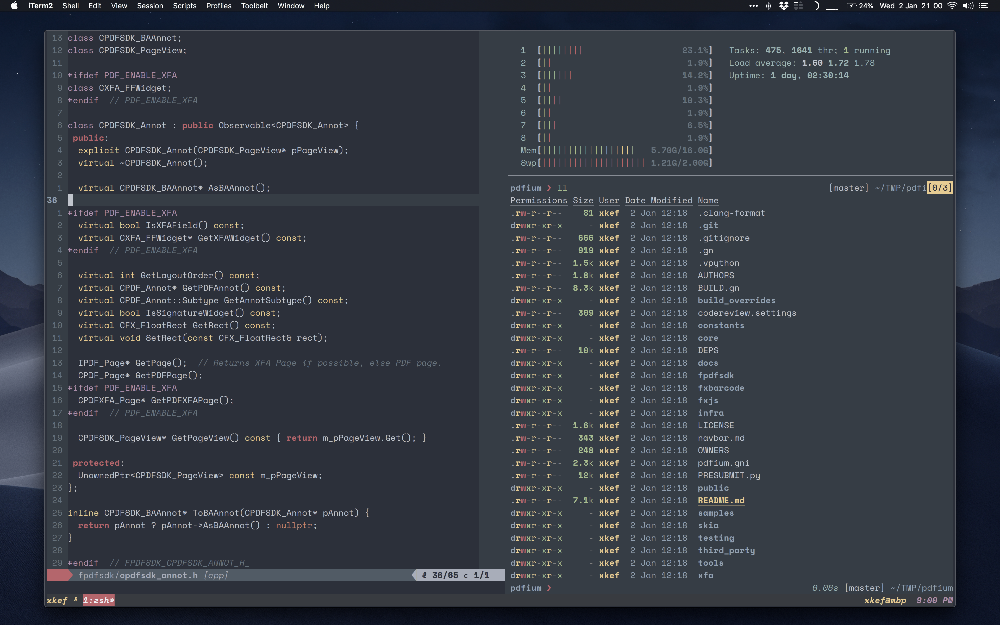

# dotfiles

mostly stolen from wincent/wincent, amazing work!!

## folder structure

```sh
./bin           -> custom bash scripts

./conf          -> macos, vscode, firefox, ...

./dotfiles      -> zsh, tmux, vim
```



## software

**shell:**

| tldr, httpie, skim, brew, scc, jq,
| bat, wrk, htop, iftop, gtop, fd, exa, xsv, ...

**gui:**

| inscape, wireshark, vscode, sublime text, 1password, hidden bar, spectacle, karabiner, dropbox
