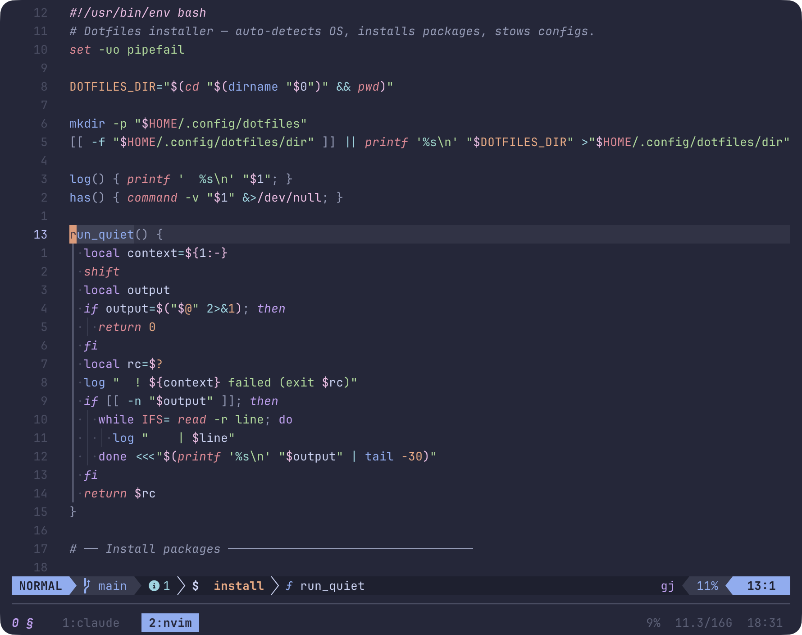

# dotfiles



Managed with [GNU Stow](https://www.gnu.org/software/stow/).
Supports macOS and Arch Linux (btw).

```bash
git clone https://github.com/xkef/dotfiles.git ~/dotfiles
cd ~/dotfiles && ./install
```

The `install` script auto-detects your OS and installs packages using the
native format (`Brewfile` on macOS, `pkgs.arch` on Arch). Then it symlinks the
explicit package manifest in `stow-packages` via Stow and sets fish as the
default shell.

> **Work laptop:** sign in to the 1Password CLI (`op signin`, or enable the
> desktop-app integration) before running `./install`. The installer reads
> `op://Work/git/{name,email}` and renders `~/.config/git/config.work` so
> commits inside `~/work/` use the work identity automatically. On personal
> machines without that vault item, the step is a silent no-op.

## What's included

| Tool                                                             | What it does                                            |
| ---------------------------------------------------------------- | ------------------------------------------------------- |
| [Fish](https://fishshell.com)                                    | Shell with fzf completions, sane defaults               |
| [Starship](https://starship.rs)                                  | Minimal, cross-shell prompt                             |
| [Neovim](https://neovim.io) + [LazyVim](https://www.lazyvim.org) | Editor with LazyVim distro (kickstart kept as fallback) |
| [tmux](https://github.com/tmux/tmux)                             | Terminal multiplexer with vim navigation                |
| [Ghostty](https://ghostty.org)                                   | Terminal emulator config                                |
| [fzf](https://github.com/junegunn/fzf)                           | Fuzzy finder everywhere (shell, tmux, neovim)           |
| [atuin](https://atuin.sh)                                        | Searchable shell history with sync                      |
| [Claude Code](https://claude.ai/), pi                            | AI coding agents (`sb claude` for sandbox)              |
| [jj (Jujutsu)](https://github.com/jj-vcs/jj)                     | Git-compatible VCS with simpler mental model            |
| eza, bat, fd, ripgrep, zoxide, yazi, mise                        | Modern CLI defaults and workflow tools                  |

## Stow packages

The default profile is the ordered manifest in `stow-packages`:

```text
dots shell cli theme terminal tmux nvim vcs ai ssh mise yazi helix vm zed
```

Top-level repo assets (`README.md`, `docs/`, `Brewfile`, `pkgs.arch`,
`mise.toml`, etc.) are not stowed by construction. Package-local adapters live
with their owner and extend shared target seams such as fish `conf.d`, tmux
`conf.d`, LazyVim `lua/plugins`, and `~/.local/bin`.

See [docs/stow-packages.md](docs/stow-packages.md) for the ownership rules,
shared seams, and migration notes.

## Maintenance

```sh
make install        # Full install (packages + stow + tools)
make update         # Pull, re-stow, update plugins and tools
make doctor         # Check dotfiles health (binaries, symlinks, configs)
make restow         # Re-stow (fixes stale symlinks)
make stow-smoke     # Stow all packages into a temporary HOME
```

Or use the `dots` command directly:

```sh
dots doctor         # Check health
dots update         # Update everything
dots versions       # Show tool versions
dots keys           # Keybinding reference
dots theme --list   # Available themes
dots skills         # Refresh shared AI skills (requires ai package)
```

AI tooling details live in [docs/ai.md](docs/ai.md).

---

## The one thing to remember

| Context    | Key          |        |
| ---------- | ------------ | ------ |
| **Neovim** | `Space`      | leader |
| **tmux**   | `Ctrl-Space` | prefix |

Same physical key. Ctrl is the only difference.

## Finding keybindings

| Where      | How          | What                                  |
| ---------- | ------------ | ------------------------------------- |
| **tmux**   | `prefix + ?` | Keybinding reference (floating popup) |
| **Neovim** | `leader + ?` | which-key discovery popup             |
| **Shell**  | `Ctrl-G`     | navi interactive cheatsheets          |

---

## Themes

`dots theme <name>` switches Ghostty, LazyVim, tmux, and delta together in one
shot. `--list` shows Ghostty themes that have a matching LazyVim colorscheme
plugin installed.

```sh
dots theme --list             # available themes (current marked with *)
dots theme "Catppuccin Mocha" # switch
dots theme auto               # match macOS / GNOME light/dark
```

bat rides the terminal palette via `BAT_THEME=ansi`; eza inherits it from the
default ANSI color scheme. No per-theme config needed for either.

## Local overrides

| What          | File                                  |
| ------------- | ------------------------------------- |
| Fish          | `~/.config/fish/local.fish`           |
| Git           | `~/.config/git/config.local`          |
| Git (~/work/) | `~/.config/git/config.work`           |
| jj            | `jj config set --user user.name "…"`  |
| Neovim        | `~/.config/lazyvim/lua/plugins/*.lua` |
| tmux          | `~/.config/tmux/local.conf`           |
| SSH           | `~/.ssh/conf.d/*.conf`                |

---

## Credits

Heavily inspired by [wincent/wincent](https://github.com/wincent/wincent) --
tmux, neovim structure, keymaps, and general philosophy. Also borrows from:

- [omerxx/dotfiles](https://github.com/omerxx/dotfiles) -- tooling and tmux
- [ThePrimeagen](https://github.com/ThePrimeagen/.dotfiles) -- tmux-sessionizer
- [folke/LazyVim](https://github.com/LazyVim/LazyVim) -- Neovim distro and
  plugin ecosystem
