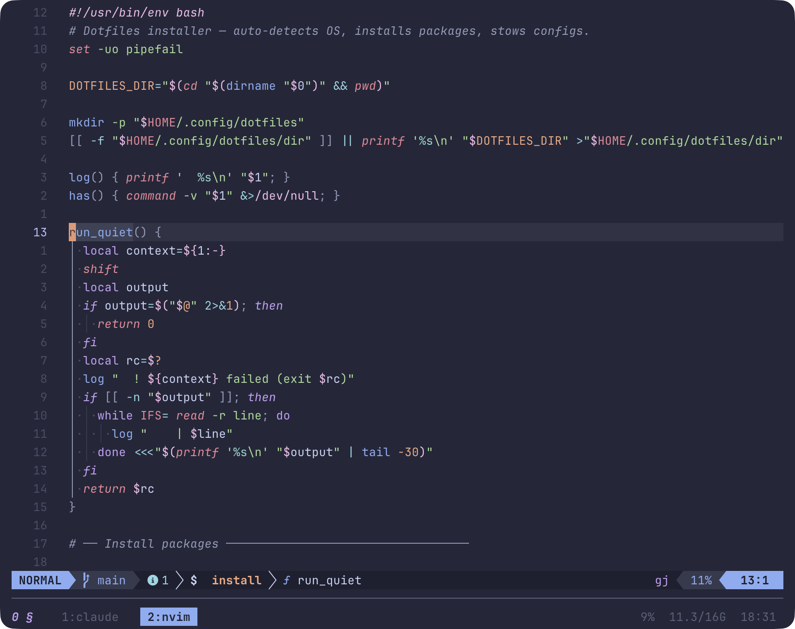

# dotfiles

[](https://github.com/xkef/dotfiles/actions/workflows/ci.yml)
[](https://scorecard.dev/viewer/?uri=github.com/xkef/dotfiles)

Every push runs the full setup end-to-end on macOS and Arch: packages
install, configs apply, and CI verifies that fish boots, tmux starts, and
the helper scripts run.



Managed with [chezmoi](https://www.chezmoi.io).
Supports macOS and Arch Linux (btw).

One command on a fresh machine:

```bash
sh -c "$(curl -fsLS get.chezmoi.io)" -- init --apply xkef/dotfiles
```

Or clone first to hack on it:

```bash
git clone https://github.com/xkef/dotfiles.git ~/dotfiles
sh -c "$(curl -fsLS get.chezmoi.io)" -- -b ~/.local/bin   # or: brew install chezmoi
chezmoi init --source ~/dotfiles --apply
```

`chezmoi init` asks one question (work machine or not), installs packages
with the native package manager (Homebrew on macOS, pacman/paru on Arch),
writes every config into `$HOME`, installs mise tools, and sets fish as the
default shell.

> **Work laptop:** answer yes to the work prompt and sign in to the
> 1Password CLI (`op signin`, or enable the desktop-app integration).
> chezmoi renders `~/.config/git/config.work` from `op://Work/git/*` so
> commits inside `~/work/` use the work identity. Personal machines answer
> no once and the file is never created.

## Try it in a container

The full setup in a disposable Arch container — the same path CI exercises
on every push, and nothing touches your machine. AUR builds take a few
minutes; GUI packages are skipped automatically inside containers.

```bash
docker run -it --rm archlinux:latest bash -c '
  pacman -Syu --noconfirm sudo git base-devel chezmoi &&
  useradd -m try && echo "try ALL=(ALL) NOPASSWD: ALL" > /etc/sudoers.d/try &&
  sudo -u try env HOME=/home/try chezmoi init --apply xkef/dotfiles &&
  sudo -u try env HOME=/home/try fish'
```

## What's included

| Tool                                                             | What it does                                            |
| ---------------------------------------------------------------- | ------------------------------------------------------- |
| [Fish](https://fishshell.com)                                    | Shell with fzf completions, sane defaults               |
| [Starship](https://starship.rs)                                  | Minimal, cross-shell prompt                             |
| [Neovim](https://neovim.io) + [LazyVim](https://www.lazyvim.org) | Editor with LazyVim distro (kickstart kept as fallback) |
| [tmux](https://github.com/tmux/tmux)                             | Terminal multiplexer with vim navigation                |
| [Ghostty](https://ghostty.org)                                   | Terminal emulator config                                |
| [fzf](https://github.com/junegunn/fzf)                           | Fuzzy finder everywhere (shell, tmux, neovim)           |
| [atuin](https://atuin.sh)                                        | Searchable shell history with sync                      |
| [Claude Code](https://claude.ai/), pi                            | AI coding agents (`sb claude` for sandbox)              |
| [jj (Jujutsu)](https://github.com/jj-vcs/jj)                     | Git-compatible VCS with simpler mental model            |
| eza, bat, fd, ripgrep, zoxide, yazi, mise                        | Modern CLI defaults and workflow tools                  |

## Repo layout

```text
.
├── home/                          # chezmoi source state — mirrors $HOME
│   ├── .chezmoidata/
│   │   └── packages.toml          #   every package on both OSes, one file
│   ├── .chezmoiscripts/           #   hooks: packages, defaults, mise, shell
│   ├── .chezmoitemplates/         #   shared agent-rules template
│   ├── dot_config/                #   ~/.config — one dir per tool:
│   │                              #     fish/ tmux/ lazyvim/ ghostty/ git/ …
│   ├── dot_local/bin/             #   theme, dots-keys, macos-defaults, vm
│   ├── dot_claude/ + dot_pi/      #   AI agent rules from one template
│   └── private_dot_ssh/           #   ~/.ssh, 0700/0600 enforced by chezmoi
├── docs/                          # screenshot + AI tooling docs
├── Makefile                       # fmt / lint / check
└── .github/workflows/ci.yml      # lint + apply check + e2e (macOS & Arch)
```

chezmoi encodes target metadata in source file names: `dot_` becomes a
leading dot, `executable_` sets +x, `private_` sets 0600, `exact_` removes
unmanaged files, and `.tmpl` files render as templates at apply time.

## How it works

- Source state lives under [`home/`](home) (`.chezmoiroot`); the repo root
  holds only metadata (package manifests, Makefile, docs, CI).
- Every package on both OSes is declared once in
  [`home/.chezmoidata/packages.toml`](home/.chezmoidata/packages.toml);
  `run_onchange` hooks template over it and re-run `brew bundle` / `paru`
  exactly when the declaration changes.
- [`macos-defaults`](home/dot_local/bin/executable_macos-defaults) applies
  curated macOS settings with `--dry-run` and timestamped TSV backups for
  `--restore`; a hook runs it when its content changes.
- The work git identity is a template gated on the one-time `work` prompt
  and `op` being installed — `onepasswordRead` fills it at apply time; no
  secrets in the repo.
- Agent rule files (`~/.claude/CLAUDE.md`, `~/.pi/agent/AGENTS.md`) render
  from one shared template plus per-tool additions
  ([details](docs/ai.md)).
- `exact_` directories (fish `conf.d`, tmux `conf.d`, `theme.d`) remove
  files the repo no longer manages, so stale fragments cannot survive.
- CI applies the whole tree into a throwaway `$HOME` on Linux and macOS
  (`make check`) and lints shell, fish, and markdown.

## Daily workflow

```sh
chezmoi diff          # what would change
chezmoi apply         # write configs to $HOME
chezmoi update        # pull + apply
chezmoi edit --apply ~/.config/fish/config.fish   # edit via source
```

Or edit files under `home/` in the repo and `chezmoi apply`. After Neovim
plugin updates, harvest the lockfiles back into the repo:

```sh
chezmoi re-add ~/.config/lazyvim/lazy-lock.json ~/.config/kickstart/lazy-lock.json
```

Repo maintenance:

```sh
make fmt         # format everything (stylua, shfmt, fish_indent, dprint, taplo)
make lint        # shellcheck, fish syntax, markdown, headless LazyVim
make check       # apply the tree into a throwaway HOME and assert results
```

---

## The one thing to remember

| Context    | Key          |        |
| ---------- | ------------ | ------ |
| **Neovim** | `Space`      | leader |
| **tmux**   | `Ctrl-Space` | prefix |

Same physical key. Ctrl is the only difference.

## Finding keybindings

| Where      | How          | What                                  |
| ---------- | ------------ | ------------------------------------- |
| **tmux**   | `prefix + ?` | Keybinding reference (floating popup) |
| **Neovim** | `leader + ?` | which-key discovery popup             |

---

## Themes

`theme <name>` switches Ghostty, LazyVim, tmux, and delta together in one
shot. `--list` shows Ghostty themes that have a matching LazyVim colorscheme
plugin installed.

```sh
theme --list             # available themes (current marked with *)
theme "Catppuccin Mocha" # switch
theme auto               # match macOS / GNOME light/dark
```

bat rides the terminal palette via `BAT_THEME=ansi`; eza inherits it from the
default ANSI color scheme. No per-theme config needed for either.

## Local overrides

| What          | File                                  |
| ------------- | ------------------------------------- |
| Fish          | `~/.config/fish/local.fish`           |
| Git           | `~/.config/git/config.local`          |
| Git (~/work/) | `~/.config/git/config.work`           |
| jj            | `jj config set --user user.name "…"`  |
| Neovim        | `~/.config/lazyvim/lua/plugins/*.lua` |
| tmux          | `~/.config/tmux/local.conf`           |
| SSH           | `~/.ssh/conf.d/*.conf`                |

AI tooling details live in [docs/ai.md](docs/ai.md).

## Make it yours

Forking? The personal identity lives in four places:

- `home/dot_config/git/config.tmpl` — name/email render from
  `op://Personal/git/*` when the 1Password CLI is present; edit the
  fallback values (or your own `op` item) to replace them.
- `home/dot_config/git/config.tmpl` `[user] signingkey` and
  `home/dot_config/git/allowed_signers` — the commit-signing SSH key.
- `home/private_dot_ssh/github_xkef.pub` — the GitHub SSH public key.
- `README.md` — the install one-liners reference `xkef/dotfiles`.

Everything else is identity-free.

---

## Credits

Heavily inspired by [wincent/wincent](https://github.com/wincent/wincent) --
tmux, neovim structure, keymaps, and general philosophy. Also borrows from:

- [omerxx/dotfiles](https://github.com/omerxx/dotfiles) -- tooling and tmux
- [ThePrimeagen](https://github.com/ThePrimeagen/.dotfiles) -- tmux-sessionizer
- [folke/LazyVim](https://github.com/LazyVim/LazyVim) -- Neovim distro and
  plugin ecosystem
