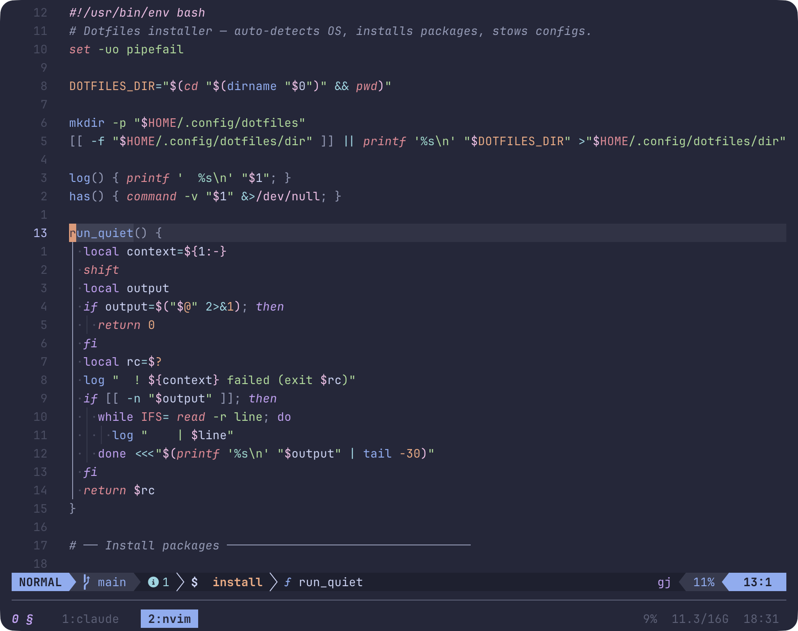

# dotfiles

[](https://github.com/xkef/dotfiles/actions/workflows/ci.yml)
[](https://scorecard.dev/viewer/?uri=github.com/xkef/dotfiles)



macOS and Arch Linux dotfiles, deployed with
[Dotter](https://github.com/SuperCuber/dotter).

## Install

```bash
git clone https://github.com/xkef/dotfiles ~/dotfiles
~/dotfiles/setup/deploy
```

This installs packages with Homebrew or pacman, links configs into `$HOME`, and
sets fish as the default shell. `dots apply` deploys again after a change.

Deploy selects three packages: `core`, `desktop` for GUI apps, and `agents` for
Claude Code, pi, and the Lima VM that runs them. Inside a VM it selects `core`
and `agents`. The `packages` list in `~/.local/state/dotter/local.toml` changes
the selection.

A package that fails to install doesn't stop the deploy, and the next deploy
retries it. `dots repair` reruns every setup step, which restores what an
earlier step installed and has since gone missing.

## Included tools

| Tool                                                                | What it does                                               |
| ------------------------------------------------------------------- | ---------------------------------------------------------- |
| [Fish](https://fishshell.com)                                       | Shell with tv pickers and practical defaults               |
| [Starship](https://starship.rs)                                     | Minimal, cross-shell prompt                                |
| [Neovim](https://neovim.io) + [LazyVim](https://www.lazyvim.org)    | Editor with the LazyVim distro, kickstart as fallback      |
| [WezTerm](https://wezterm.org)                                      | Terminal and multiplexer, with an agent picker             |
| [tinty](https://github.com/tinted-theming/tinty)                    | Color themes for the terminal, Neovim, delta, and pi       |
| [television](https://github.com/alexpasmantier/television)          | Fuzzy finder in the shell and WezTerm pickers              |
| [atuin](https://atuin.sh)                                           | Searchable shell history with sync                         |
| [Claude Code](https://claude.com/claude-code), [pi](https://pi.dev) | AI coding agents, always launched in a nono sandbox        |
| [Jujutsu](https://github.com/jj-vcs/jj)                             | Git-compatible version control, `jj`, with a simpler model |
| [Lima](https://lima-vm.io)                                          | Linux development VM with the host's dotfiles setup        |
| [Vale](https://vale.sh)                                             | Prose linter for markdown, Google style plus AI-tell rules |
| eza, bat, fd, ripgrep, zoxide, yazi, mise                           | Command-line replacements and workflow tools               |

## Keys

Neovim uses `Space` as leader and WezTerm uses `Ctrl-Space`. `leader ?` in
either lists the bindings.

`dots theme` switches WezTerm, Neovim, delta, and pi together through tinty.

## Agent sandbox

`claude` and `pi` run in a [nono](https://nono.dev) sandbox with the profile of
the same name. The agent can:

- Read and write the current directory, its own config and state, and the
  toolchain directories.
- Read this repo, the git and jj config, and the gh config with its GitHub
  token.
- Use the macOS keychain and the 1Password SSH agent, so it can sign and push.
- Reach any host on the network.

`sb --strict claude` runs the `claude-strict` profile for an unfamiliar
repository. It drops the gh config, the SSH agent, `GH_TOKEN`, and
`GITHUB_TOKEN`. It keeps the keychain, which holds the Claude Code login, and
the network.

`lima-agent` runs Claude Code in the Lima VM with permission prompts off. The VM
mounts `~/code` and `~/work` read-write and this repo read-only. It also gets
the host's SSH agent and a gh token, so the agent there can change and push any
repository under `~/code` or `~/work`.

## Make it yours

Deploy writes the git, jj, and SSH identity from `~/.config/identity/Personal`:

```sh
name=Ada Lovelace
email=ada@example.com
public_key=ssh-ed25519 AAAA...
```

Without that file, it reads the same fields from the SSH Key item `git` in the
1Password `Personal` vault.

## Credits

Inspired by [wincent/wincent](https://github.com/wincent/wincent), with
borrowings from [omerxx/dotfiles](https://github.com/omerxx/dotfiles),
[ThePrimeagen](https://github.com/ThePrimeagen/.dotfiles), and
[LazyVim](https://github.com/LazyVim/LazyVim).
